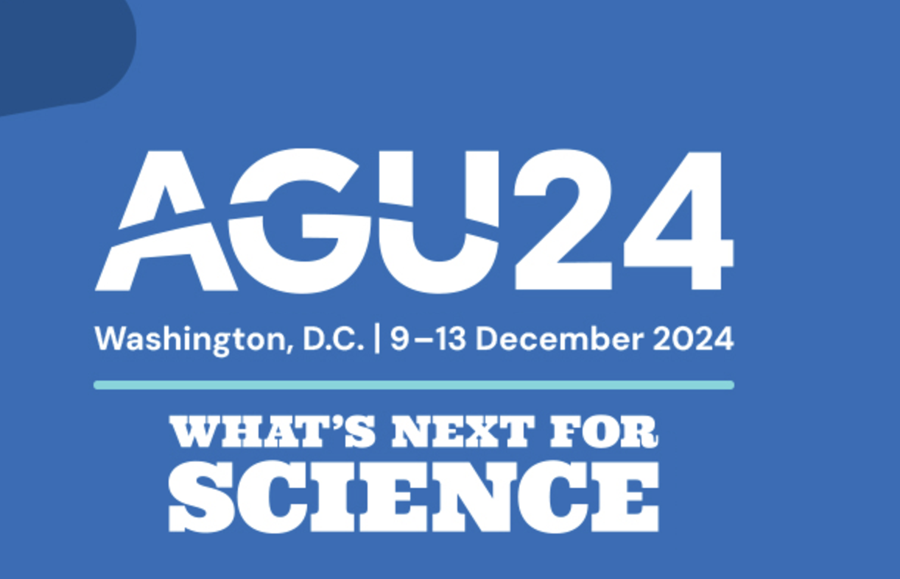

# [CESM Tutorial at AGU](https://ncar.github.io/CESM-Tutorial-AGU/README.html)

**Time**: Dec 10, 2024

**Location**: 
___

___

### Planning committee
Cecile Hannay, Isla Simpson, and Brian Dobbins

### Purpose

The Community Earth System Model (CESM) version 2, is a state-of-the-art global Earth System Model that can be used for prediction and understanding of a wide variety of aspects of the Earth system. CESM2 is freely available for use by the climate research community making it an ideal tool for Earth System research and education. The capabilities within CESM2 range from idealized models of the atmosphere to comprehensive coupled simulations of the atmosphere, ocean, land, sea-ice, and biogeochemical systems – making it a key tool for supporting leading edge research in climate science. Read more about the CESM model [here](https://www.cesm.ucar.edu/).

This workshop is intended for new users of the Community Earth System Model v2 (CESM2) who are interested in an introduction to its capabilities.  We will provide attendees with the basic building blocks for use of the model as an earth system science research tool. This will be achieved through a hands-on interactive tutorial on running and configuring CESM2 on the Amazon Web Services (AWS) cloud.

### Agenda

TBD

- 			

